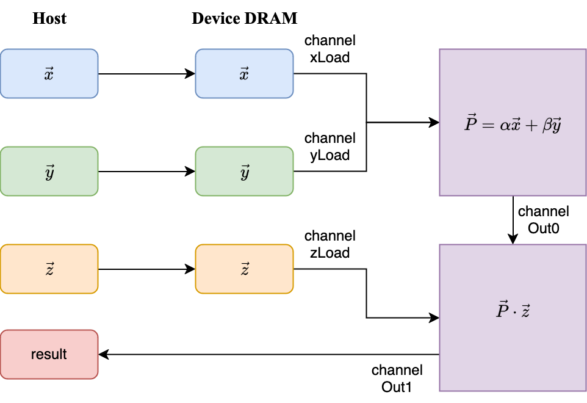

# Multi-kernel example

This example demonstrates the following calculation of vectors:

$$
(\alpha\vec x+\beta\vec y)\cdot\vec z
$$

where $\alpha$ and $\beta$ are scalars, and $\vec{x}$ , $\vec{y}$ , $\vec z$ are vectors. It requires two BLAS routines: `AXPY` and `DOT`.

## The design



The design is basically a simple combination of AXPY and DOT. In this design, the input vectors are sent to the device DRAM sequentially. Then the fpga  device simply loads data from the device DRAM sequentially via channel `xLoad`/`yLoad`/`zLoad`。

In more detail, the input vectors are loaded from device DRAM tile by tile. Each time, a pair of tiles  ($\vec x/\vec y$) are loaded from the input vectors. Then the two tiles are added on device by the axpy engine. The result (a tile of $\vec P$), will be send to the dot product engine via channel `Out0`。

Once the dot product engine receives the result of axpy, it loads a tile of $\vec z$  from DRAM, and then calculates the dot product of two tiles. The result is stored into a register. When all tiles are calculated, the final result will be sent back to the host.

For more details about the two BLAS routines, see [README.md](../reconfigurable_dotprod/README.md) (dot) and [README.md](../reconfigurable_vecadd/README.md) (axpy).

## Implementation

The core of the implementation is very simple as it reuses a lot of `axpy` / `dot` code. Thanks to the expose primitive in T2SP, the calculation engines and loaders can be extracted from the full implementation and used independently. More specifically,  the dot engine, axpy engine and three vector loaders mentioned above are all separated from the full implementation. Here is a snippet of core code:

```cpp
using xLoader = pipe_wrapper<class xLoader_class, sycl::float4, 256>;
using yLoader = pipe_wrapper<class yLoader_class, sycl::float4, 256>;
using zLoader = pipe_wrapper<class zLoader_class, sycl::float4, 256>;
using Out0 = pipe_wrapper<class Out0_class, sycl::float4, 256>;
//...
std::vector<std::vector<sycl::event>> events{};
events.push_back(svecadd::xyloader<xLoader, yLoader>(device, device_x, device_y, size));
events.push_back(svecadd::axpy<xLoader, yLoader, Out0>(device, alpha, beta, size));
events.push_back(sdotprod::zloader<zLoader>(device, device_z, size, 1));
events.push_back(sdotprod::dot<Out1, Out0, zLoader>(device, false, size, 1));
```

where `xyloader` is the loader of $\vec x$ and $\vec y$，`zloader` is the loader of $\vec z$ , `axpy` is the axpy engine and `dot` is the dot product engine. These separated components are connected through channels (`pipe_wrapper`) and data are transferred between components via these channels.

## Build

Just run `build.sh`

```shell
git clone -b hello_world https://github.com/someoneinjd/xblas
# Don't forget to set up the oneAPI environment
# In most cases, just run the following command to set up
#    source /opt/intel/oneapi/setvars.sh --force
cd xblas/blas/hello_world
./build.sh
```

You can also build manually:

```shell
git clone -b hello_world https://github.com/someoneinjd/xblas
# Don't forget to set up the oneAPI environment
# In most cases, just run the following command to set up
#    source /opt/intel/oneapi/setvars.sh --force
cd xblas/blas
# Build dot
mkdir -p dot/build && cd dot/build
cmake .. && make oneapi_sdotprod_tiny_a10
# Build axpy
mkdir -p ../../axpy/build && cd ../../axpy/build
cmake .. && make oneapi_svecadd_tiny_a10

# Copy the exported files to hello_world
mkdir -p ../../hello_world/build && cd ../../hello_world/build
mkdir -p include/dot && cp ../../reconfigurable_dotprod/bin/exposed_funcs.hpp include/dot/
mkdir -p include/dot && cp ../../reconfigurable_vecadd/bin/exposed_funcs.hpp include/axpy/

# Compile
cd ..
icpx -fsycl -fintelfpga \
     -I build/include \
     -I ../../include \
     -I ../../tools/Halide/include \
     -L ../../tools/Halide/lib \
     -lm -ldl -lsycl -lHalide \
     kernel.cpp -o kernel
```

`./kernel` is the final executable file.

